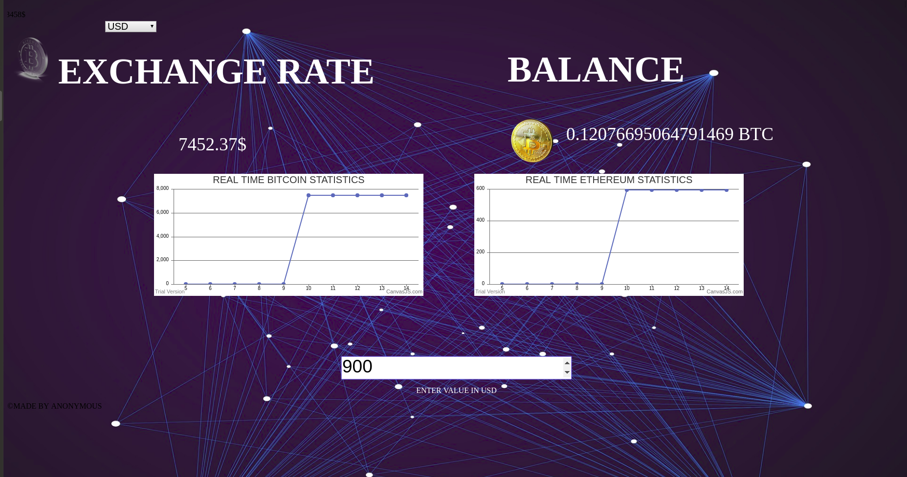

# CRYPTO-WALLET

This is a project in which we have tried to make a an crypto currency wallet...

## PREQUESTIES

1. Any Web Browser (Preferred Chrome)
2. Good Internet Connection
3. GIT (Version Controlling System)

## RUN (all os)

1. Open the terminal and execute the given command:

```bash
git clone https://github.com/GauravWalia19/CRYPTO-WALLET.git
```

OR

1. Download zip from the link https://github.com/GauravWalia19/CRYPTO-WALLET.git and Extract the zip file.
2. Open the folder named CRYTO-WALLET.
3. Double click on index.html.
4. Open the browser.

## SCREENSHOT OF REAL TIME WALLET



## AUTHOR

1. GAURAV WALIA
2. OCTAHACK TEAM